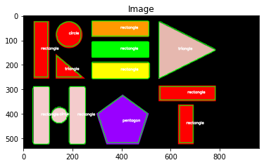

# Object Detection "Contour Approximation"


- Contour-based processing
- Think of manufacturing or top-down imagery to detect objects and label
- Leverage basic CV techniques to minimize complexity in ML and offload model
- Contour Approximation is an algorithm for reducing the number of points in a curve with a reduced set of points
- aka "Ramer-Douglas-Peucker" algorithm or "split-and-merge"
- a curve can be approximated by a series of short lines segments
- implemented in openCV as `cv2.approxPolyDP`

How?
A contour consists of a list of verticies (ex. contour = 3 verticies = triangle)
1. compute the perimeter of the contour
1. construct actual contour approximation

```
.
├── Pipefile
├── README.md
├── detect_shapes.py        # driver script loads image, analyze, performs detector
├── redhat-shapes.png
├── requirements.txt
├── shape_detection.ipynb   # interactive notebook performing same tasks as raw python
├── shapes_and_colors.png
└── submodules
    ├── __init__.py
    └── shapedetector.py    # takes contour, using contour approx., id shape

```